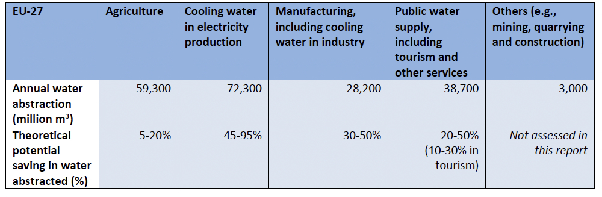

Europe drought 2026
================

# Introduction

Fix leaks or ban pools: As European countries prepare for hotter, drier
years to come, here’s what the data says about how to really save water.

*In this repository, you will find the methodology, data and code behind
the stories that came out of this analysis.*

**Read the full story here:** [English](https://www.dw.com/a-78577712)
\| [Spanish](https://www.dw.com/es/a-78650790) \|
[German](https://www.dw.com/es/a-xxx)

**Instagram:**
[@dw_environment](https://www.instagram.com/p/Dc01484EXHi/)

**Story by:** [Kira
Schacht](https://www.dw.com/en/kira-schacht/person-46893544)

- `analysis.Rmd` is the main file that contains the R code for the
  analysis
- `data/...` contains the raw data files used in the analysis, as well
  as the output data

# Read Data

## eurostat

We use the following eurostat datasets:

- [env_wat_cat](https://ec.europa.eu/eurostat/databrowser/view/env_wat_cat/default/table?lang=en&category=env.env_wat.env_nwat):
  Water use by supply category and economical sector, latest 10 years
- [demo_gind](https://ec.europa.eu/eurostat/databrowser/view/demo_gind/default/table?lang=en):
  Annual average population, since 2000

## EEA data

In addition, the dataset [EEA: Water abstraction by economic sector,
2000-2023](https://www.eea.europa.eu/en/analysis/indicators/water-abstraction-by-source-and/water-abstraction-by-economic-sector?activeTab=658e2886-cfbf-4c2f-a603-061e1627a515)
offers more complete figures on water use by sector for 37 European
countries, including the 27 current EU member states.

We exported each country’s dataset as a csv file on August 26, 2026.

It contains water abstraction in million m3 of water per year by sector,
divided into:

- “Agriculture” (NACE Section A)
- “Manufacturing” (Section C)
- “Public water supply” (Section E)
- “Electricity cooling” (Section D)
- “Others” (contains “Mining and Quarrying”, “Construction”, Sections B
  and F)

The categories sum to the total water abstraction for each country.

# Analysis

## Water use per sector

### Calculate households share of public water supply

The dataset provided by the EEA does not include households as a
separate category, but the eurostat data does have separate household
water use available for some countries.

Where possible, we will extract the share of public water supply used by
households from the eurostat dataset for the latest available year and
apply it to the EEA data:

`EP_HH / TOTAL_HH = "Households" / "All NACE activities plus households"`

The eurostat dataset gives us the following values (in liters per person
per day) and shares (in % of all public water supply) for households:

| geo | values_pp | share |
|:----|----------:|:------|
| BE  |        84 | 40%   |
| BG  |       111 | 41%   |
| CZ  |        84 | 41%   |
| DK  |       106 | 39%   |
| DE  |       125 | 47%   |
| EL  |       220 | 46%   |
| ES  |       129 | 40%   |
| HR  |       129 | 41%   |
| IT  |       168 | 45%   |
| CY  |       294 | 48%   |
| LV  |        50 | 49%   |
| LT  |        76 | 41%   |
| HU  |       106 | 45%   |
| MT  |       120 | 41%   |
| NL  |       117 | 41%   |
| PL  |       100 | 44%   |
| RO  |        85 | 36%   |
| SI  |       100 | 40%   |
| SE  |       131 | 41%   |
| NO  |       173 | 40%   |
| CH  |       154 | 38%   |
| ME  |       158 | 41%   |
| MK  |       153 | 43%   |
| AL  |       135 | 47%   |
| RS  |       137 | 42%   |
| TR  |       119 | 43%   |

### Water use per sector for 2023

#### EU total

calculate shares for each sector across all eu countries

| var                 | values_pp |
|:--------------------|----------:|
| Agriculture         |       361 |
| Electricity.cooling |       391 |
| Manufacturing       |       154 |
| Others              |        17 |
| Public.water.supply |       248 |

#### Per country

output see `data/processed/eea_countries.csv`

## Total possible water savings in the EU

The EEA report [Contributions of water saving to a climate resilient
Europe (ETC BE Report
2025/1)](www.eionet.europa.eu/etcs/etc-be/products/etc-be-products/etc-be-report-2025-1-contributions-of-water-saving-to-a-climate-resilient-europe)
analyzes potential water savings for EU countries in each sector.

See this table on page 10:

We’ll use this table to calculate and chart the potential savings for
each sector in absolute terms:

| var                 | values_pp | percent_low | percent_high | saving_low | saving_high |
|:--------------------|----------:|------------:|-------------:|-----------:|------------:|
| Agriculture         | 360.62833 |        0.05 |         0.20 |   342.5969 |   288.50266 |
| Electricity.cooling | 390.69899 |        0.45 |         0.95 |   214.8844 |    19.53495 |
| Manufacturing       | 154.28574 |        0.30 |         0.50 |   108.0000 |    77.14287 |
| Others              |  16.95702 |          NA |           NA |         NA |          NA |
| Public.water.supply | 248.06845 |        0.20 |         0.50 |   198.4548 |   124.03423 |

\##Water use in the EU over time

output see `data/processed/eea_time.csv`

# Quality control disclaimer

The code used in this analysis was written by the author. For all of our
analyses, if any portion of the code is LLM-generated, this is flagged
in the script.

All code in this project has been reviewed pre-publication by both the
author as well as a second person to ensure quality.

Should you have any questions or notice errors or inconsistencies,
please reach out to <data-team@dw.com>.
